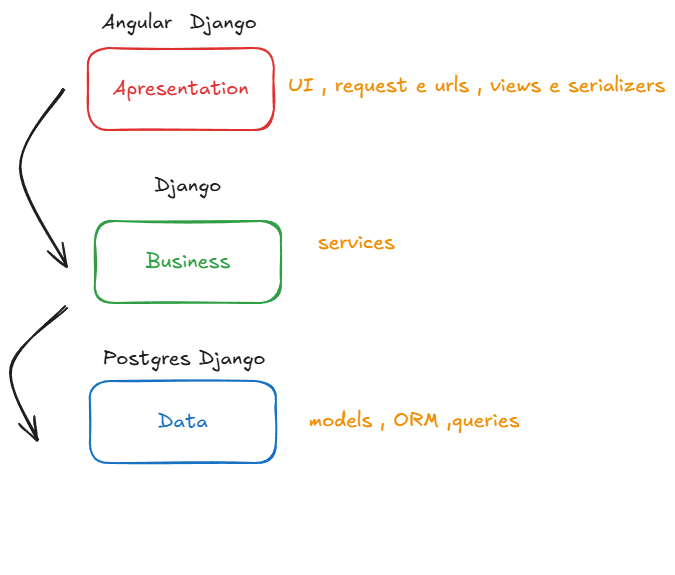
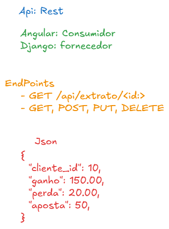

# GUIA Para configuração Do Projeto:
## Ferramentas Necessarias:

```sh
uv - Python
Postgres - Docker
Node
Angular 20+
```

## Na Linha de Comando execute e instale:

### Instalação do Angular 🔴:

```sh
 npm install -g @angular/cli
```

### Instalação Do Django 🟢:

```sh
 uv add django
```

### Subindo o postgres 🔵 para o Django:

```sh
 cd backend
 docker compose up -d
```

### Subindo o Server Web: Django 🟢

```sh
 python manage.py runserver
```

### Subindo o Server Web: Angular 🔴

```sh
 npm run serve
```

<br><br>





